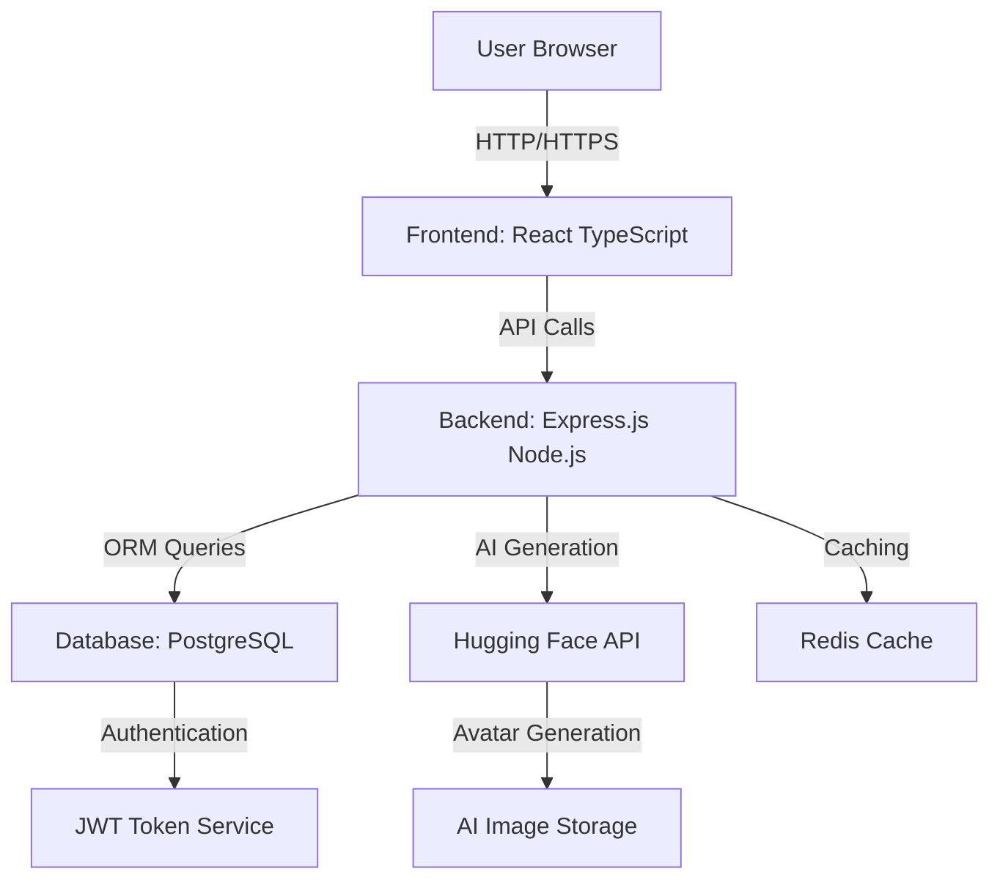
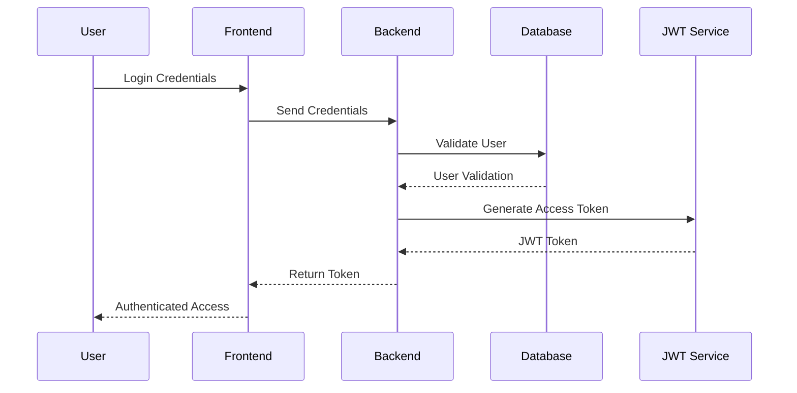
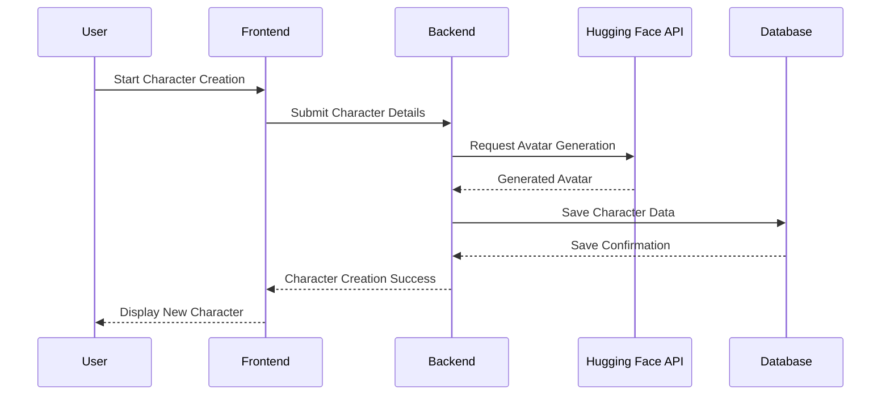
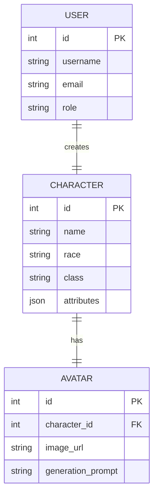
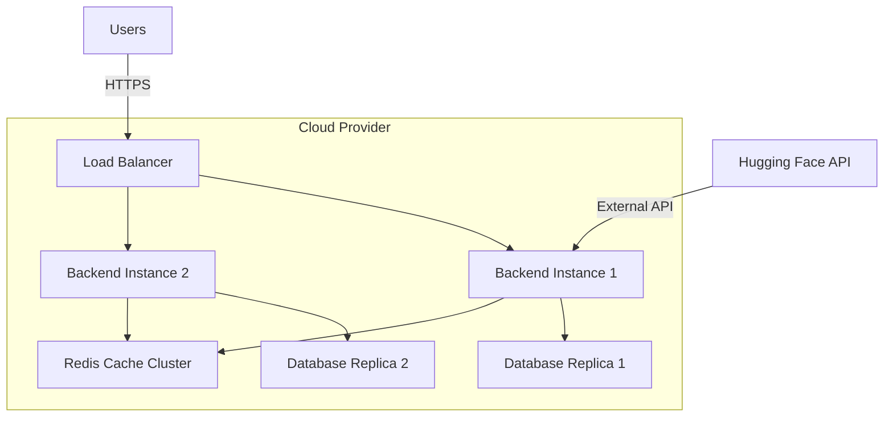
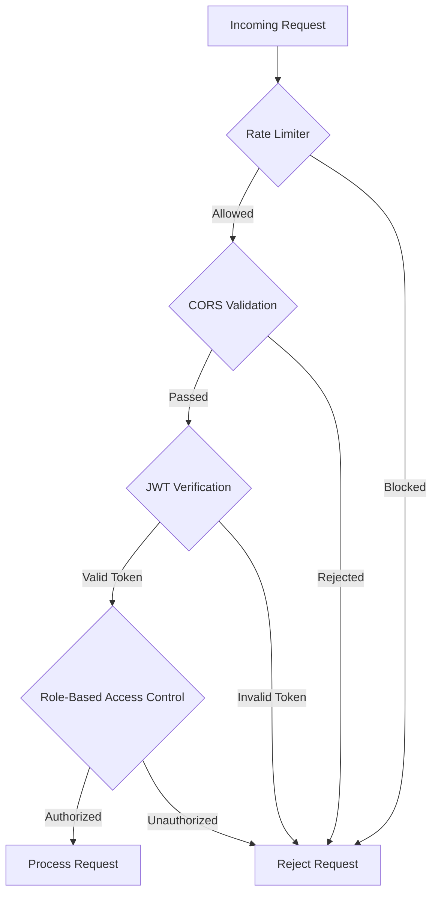

# Architectural Diagrams for Fantasy Character Creator

## 1. High-Level System Architecture

## 2. Authentication Flow Diagram

## 3. Character Creation Workflow

## 4. Data Model Relationships

## 5. Deployment Architecture

## 6. Technology Stack Overview

| Layer | Technology | Key Responsibilities |
|-------|------------|---------------------|
| Frontend | React TypeScript | User Interface, State Management |
| Backend | Node.js, Express.js | Business Logic, API Endpoints |
| Database | PostgreSQL, Prisma ORM | Data Persistence, Querying |
| Caching | Redis | Performance Optimization |
| Authentication | JWT, Passport.js | Secure User Access |
| AI Integration | Hugging Face API | Dynamic Avatar Generation |

## 7. Security Architecture

## Architectural Principles

1. Modularity
2. Scalability
3. Security
4. Performance
5. Maintainability

---

**Note:** These architectural diagrams represent the current state of the Fantasy Character Creator project, showcasing its technical design, data flow, and architectural decisions.
