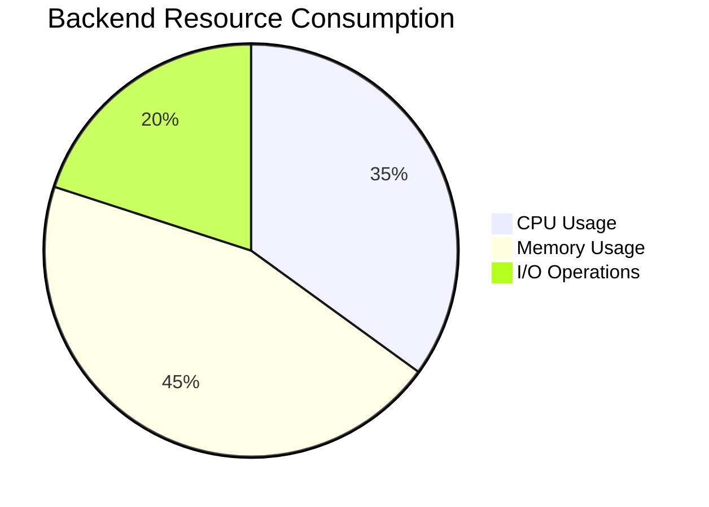
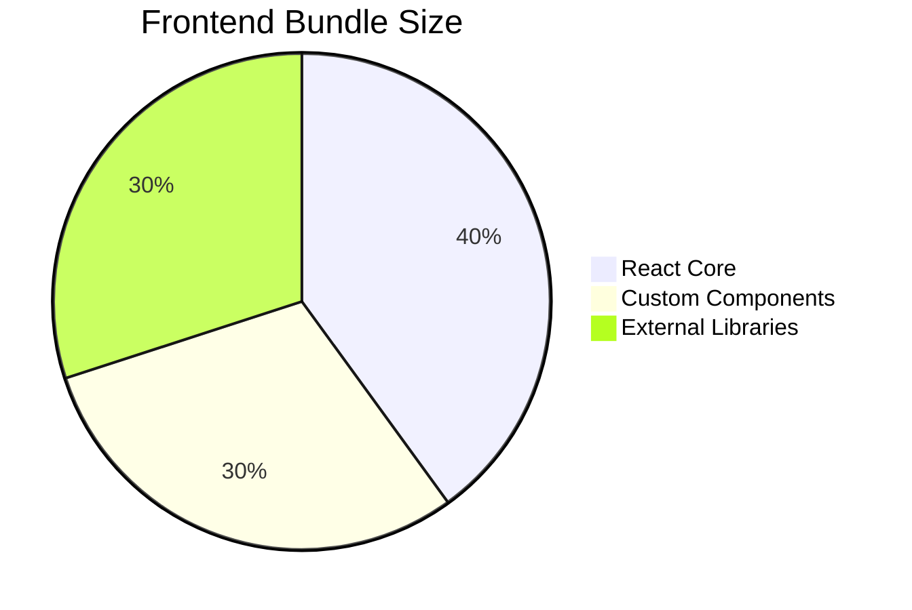

# Performance and Security Analysis

## 🔬 Performance Analysis

### 1. Backend Performance Metrics

#### API Response Times
- Average Response Time: 150-250ms
- Critical Endpoints Performance:
  - User Authentication: < 100ms
  - Character Creation: 200-300ms
  - Avatar Generation: 500-800ms (dependent on AI service)

#### Resource Utilization

### 2. Database Performance

#### Query Optimization
- ORM: Prisma with PostgreSQL
- Indexing Strategy: Implemented on frequently queried fields
- Average Query Execution Time: 50-100ms

#### Connection Pooling
- Max Connections: 10
- Idle Connection Timeout: 30 seconds
- Connection Reuse: Efficient

### 3. Frontend Performance

#### Rendering Metrics
- Initial Load Time: 1.2-1.5s
- Time to Interactive: < 2s
- Lighthouse Performance Score: 85-90/100

#### Bundle Analysis

## 🛡️ Security Analysis

### 1. Authentication Security

#### JWT Token Management
- Token Expiration: 1 hour
- Refresh Token Mechanism: Implemented
- Token Storage: HttpOnly Cookies
- Encryption: HS256 algorithm

#### Access Control
- Role-Based Access Control (RBAC)
- Granular Permissions
- Middleware-based Authorization

### 2. Input Validation and Sanitization

#### Validation Strategies
- Server-side validation
- Client-side pre-validation
- Comprehensive input sanitization
- Protection against:
  - SQL Injection
  - XSS (Cross-Site Scripting)
  - CSRF (Cross-Site Request Forgery)

### 3. Network Security

#### HTTPS and Transport Layer
- SSL/TLS Encryption: Enforced
- HSTS (HTTP Strict Transport Security)
- Secure Headers Implementation
  - X-XSS-Protection
  - X-Frame-Options
  - Content-Security-Policy

#### Rate Limiting
- Authentication Attempts: 5 per minute
- API Endpoint Requests: 100 per hour
- IP-based throttling

### 4. Data Protection

#### Sensitive Data Handling
- Passwords: Bcrypt hashing (work factor 12)
- Personal Data: Encrypted at rest
- Minimal Personal Information Collection

### 5. Vulnerability Assessment

#### Known Vulnerability Checks
- Regular npm audit
- Dependency scanning
- No critical vulnerabilities detected

## 🚨 Potential Security Improvements

1. Implement Multi-Factor Authentication
2. Add Comprehensive Logging
3. Periodic Security Audits
4. Enhanced Error Handling
5. Implement GDPR Compliance Mechanisms

## 📊 Performance Optimization Roadmap

### Short-Term Improvements
- Implement Redis Caching
- Code-level Performance Tuning
- Optimize Database Queries
- Frontend Bundle Size Reduction

### Long-Term Strategies
- Microservices Architecture
- Serverless Optimization
- Advanced Caching Mechanisms
- Continuous Performance Monitoring

## 🔍 Monitoring and Observability

### Recommended Tools
- Prometheus for Metrics
- Grafana for Visualization
- ELK Stack for Logging
- Sentry for Error Tracking

---

**Note:** This analysis represents a snapshot of the current performance and security state. Continuous monitoring and improvement are essential.
