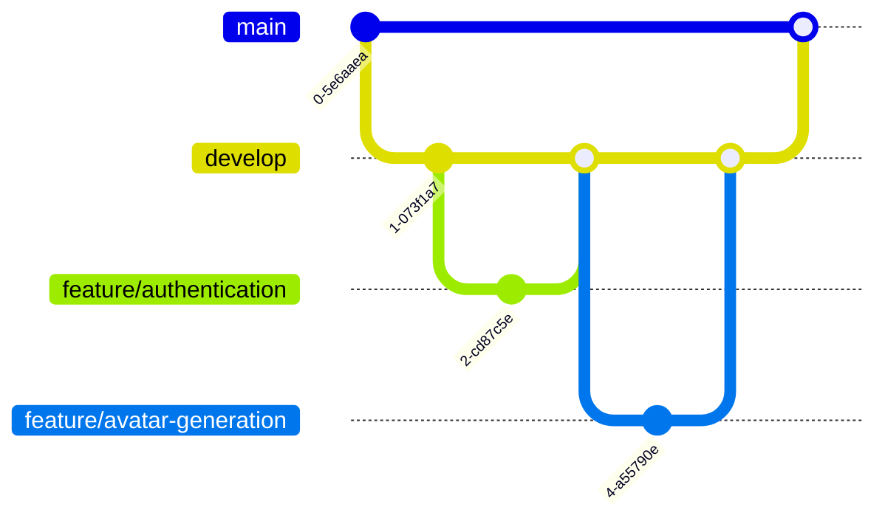

# Project Management Artifacts: Fantasy Character Creator

## 🎯 Project Management Overview

### Project Methodology
- **Approach:** Agile/Scrum Hybrid
- **Development Cycle:** Iterative and Incremental
- **Sprint Length:** 2 weeks
- **Key Principles:** Flexibility, Continuous Improvement, User-Centric Design

## 📋 Project Management Artifacts

### 1. Project Initialization Document

#### Project Charter
- **Project Name:** Fantasy Character Creator
- **Sponsor:** Personal Professional Development
- **Primary Objective:** Create an AI-powered character generation platform
- **Success Criteria:**
  - Functional AI-driven character creation
  - Robust authentication system
  - Scalable and maintainable architecture

#### Stakeholder Analysis
| Stakeholder | Interest | Influence | Engagement Strategy |
|------------|----------|-----------|---------------------|
| Developer | High | High | Direct involvement, continuous feedback |
| Potential Users | Medium | Low | User research, feedback collection |
| AI Service Providers | Low | Medium | API integration, performance monitoring |

### 2. Requirements Management

#### Initial Requirements Specification
- User authentication and authorization
- AI-powered character avatar generation
- Character creation workflow
- Responsive web interface
- Secure data management

#### Requirements Traceability Matrix
| Requirement | Priority | Status | Implemented Date | Verification Method |
|-------------|----------|--------|-----------------|---------------------|
| User Registration | High | Completed | 2024-01-15 | Unit Testing |
| JWT Authentication | High | Completed | 2024-01-20 | Integration Testing |
| Avatar Generation | High | Completed | 2024-02-10 | User Acceptance Testing |
| Responsive Design | Medium | In Progress | TBD | Cross-Browser Testing |

### 3. Risk Management Plan

#### Identified Risks
| Risk | Probability | Impact | Mitigation Strategy | Contingency Plan |
|------|-------------|--------|---------------------|------------------|
| AI API Unreliability | Medium | High | Multiple API fallback | Manual avatar upload |
| Performance Issues | Low | Medium | Caching, Query Optimization | Lazy loading, Pagination |
| Security Vulnerabilities | Low | High | Regular Security Audits | Immediate Patch Development |

### 4. Communication Management Plan

#### Communication Channels
- GitHub Issues
- Discord Development Channel
- Weekly Progress Reports
- Commit Message Conventions
- Detailed Documentation

#### Communication Frequency
| Artifact | Frequency | Medium | Audience |
|----------|-----------|--------|----------|
| Progress Report | Weekly | Markdown | Self |
| Code Review | Per Commit | GitHub | Development Community |
| Changelog | Per Milestone | Markdown | Potential Users |

### 5. Sprint Planning and Tracking

#### Sprint 1: Foundation (2024-01-01 to 2024-01-14)
- **Goal:** Project Setup and Initial Authentication
- **Completed:**
  - Project scaffolding
  - Basic user registration
  - Initial authentication flow

#### Sprint 2: Core Features (2024-01-15 to 2024-01-28)
- **Goal:** Implement Character Creation Workflow
- **Completed:**
  - Character model design
  - Basic character creation UI
  - Initial database integration

#### Upcoming Sprints
- Implement AI Avatar Generation
- Enhance User Experience
- Performance Optimization
- Security Hardening

### 6. Version Control Strategy

#### Branching Model

#### Commit Message Convention
- `feat:` New feature
- `fix:` Bug fix
- `docs:` Documentation update
- `refactor:` Code refactoring
- `test:` Adding tests
- `chore:` Maintenance tasks

### 7. Continuous Improvement Process

#### Retrospective Insights
- Regularly review project progress
- Identify learning opportunities
- Adapt development strategies
- Incorporate new technologies
- Maintain code quality

## 🌐 Project Management Tools

- **Version Control:** Git, GitHub
- **Project Tracking:** GitHub Projects
- **Communication:** Discord
- **Documentation:** Markdown, Mermaid
- **Dependency Management:** npm, package.json

---

**Note:** This document captures the project management approach, artifacts, and strategies employed in the Fantasy Character Creator project.
