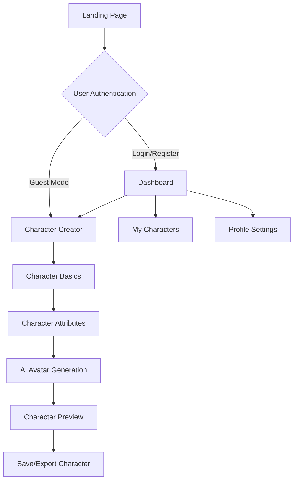
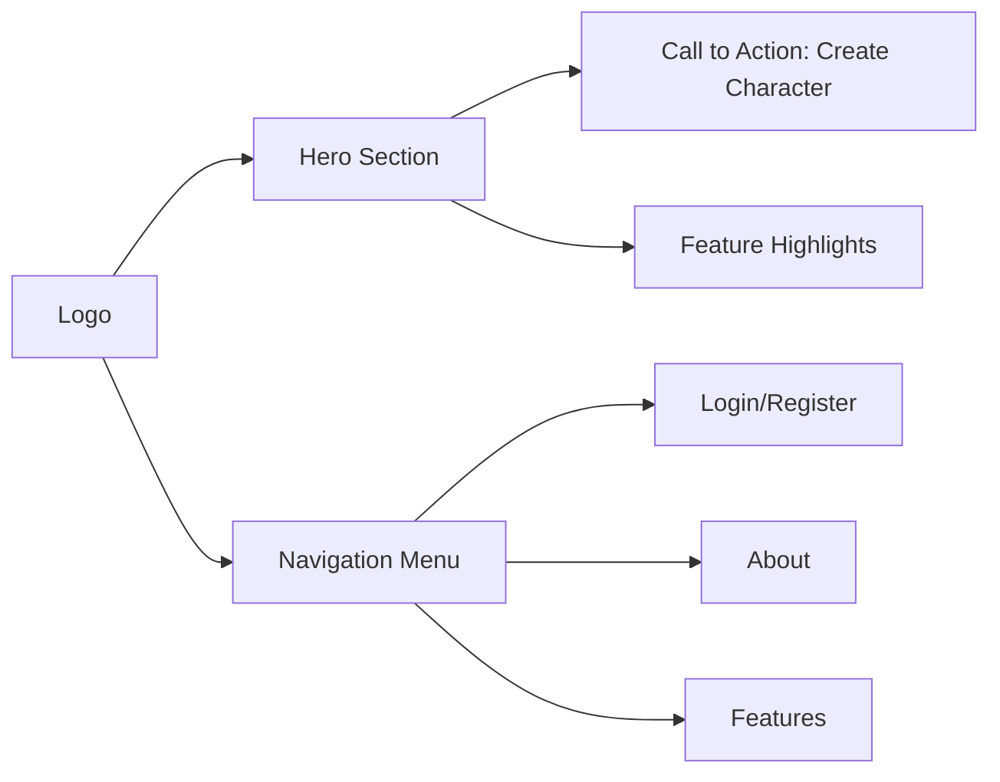
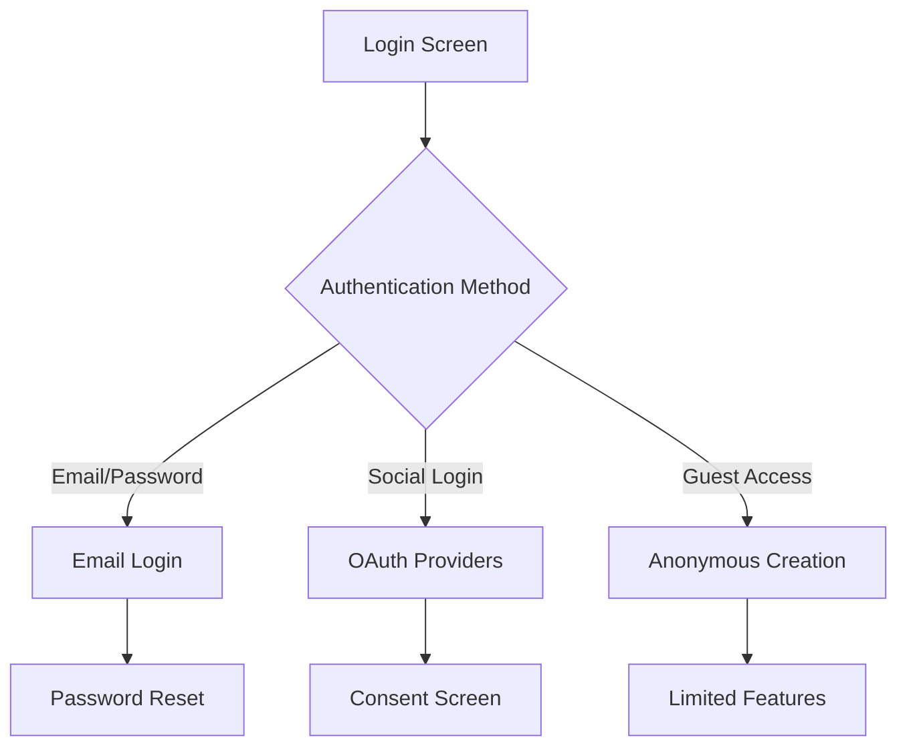
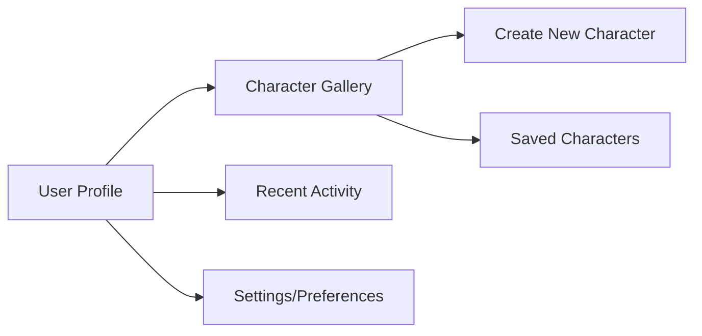
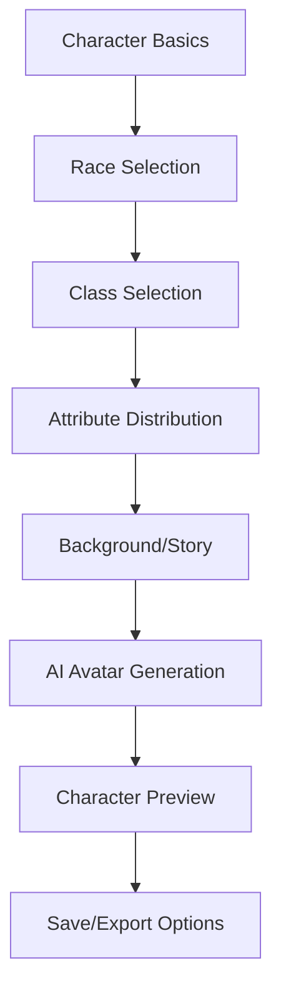

# Application Wireframes: Fantasy Character Creator

## 🎨 Design Philosophy
- User-Centric Design
- Intuitive Navigation
- Clean and Modern Aesthetic
- Accessibility-First Approach

## 📱 User Flow Diagram

## 🖥️ Key Screen Wireframes

### 1. Landing Page

### 2. Authentication Flow

### 3. Dashboard

### 4. Character Creator Workflow

## 🎯 Interaction Design Principles

### User Experience Considerations
- Minimal cognitive load
- Progressive disclosure
- Consistent design language
- Responsive across devices

### Interaction Patterns
- Drag-and-drop attribute allocation
- Contextual help tooltips
- Real-time preview updates
- Undo/Redo functionality

## 📊 Wireframe Specifications

### Screen Breakpoints
- Mobile: 320px - 480px
- Tablet: 481px - 768px
- Desktop: 769px - 1440px
- Large Screens: 1441px+

### Color Palette
- Primary: Deep Blue (#1A3B5C)
- Secondary: Emerald Green (#2ECC71)
- Accent: Warm Orange (#F39C12)
- Background: Light Gray (#F4F6F7)
- Text: Charcoal (#2C3E50)

## 🔍 Accessibility Features
- High color contrast
- Keyboard navigation
- Screen reader compatibility
- Font size adjustments
- Alternative text for images

## 🚀 Interaction Flow Examples

### Character Creation Sequence
1. Select Basic Demographics
2. Allocate Attribute Points
3. Choose Character Background
4. Generate AI Avatar
5. Preview and Customize
6. Save or Export Character

## 📝 Design Rationale
- Simplify complex character creation
- Provide guided, intuitive experience
- Leverage AI for creative inspiration
- Offer flexibility and personalization

## 🔮 Future Wireframe Enhancements
- Dark/Light mode toggle
- Advanced customization options
- Community character sharing
- Interactive tutorial system
