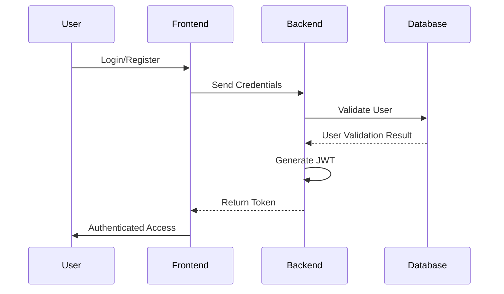
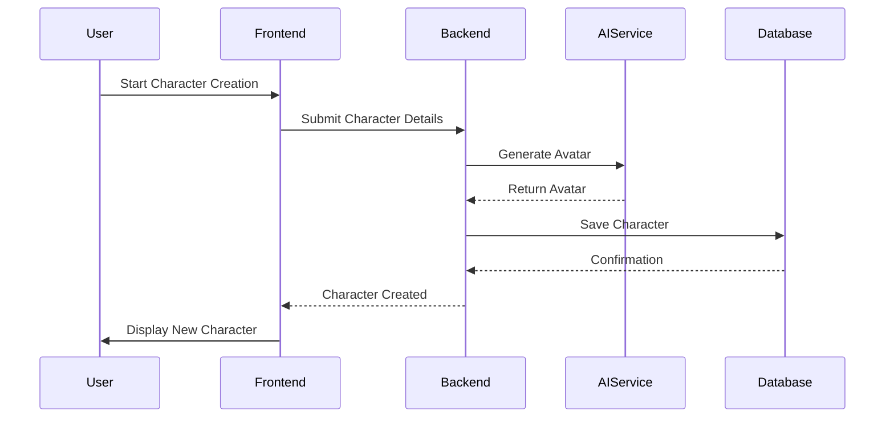

# System Architecture Documentation

## 1. Project Overview
**Project:** Fantasy Character Creator
**Version:** 1.0
**Date:** 2024-12-20

## 2. Architecture Components

### Frontend
- **Technology:** React TypeScript
- **Key Responsibilities:** 
  - User interface rendering
  - State management
  - User interactions

### Backend
- **Technology:** Node.js, Express.js
- **Key Responsibilities:**
  - API endpoint management
  - Authentication
  - Business logic processing

### Database
- **Technology:** PostgreSQL, Prisma ORM
- **Key Responsibilities:**
  - Data persistence
  - Complex query management
  - Data integrity

### AI Service
- **Technology:** Hugging Face API
- **Key Responsibilities:**
  - Avatar generation
  - Character trait recommendation

## 3. System Interactions

### Authentication Flow

### Character Creation Flow

## 4. Design Principles
- Modularity
- Scalability
- Security
- Performance
- Maintainability

## 5. Technology Rationale
[Detailed justification for each technology choice]

## 6. Future Evolution
[Potential architectural improvements]
