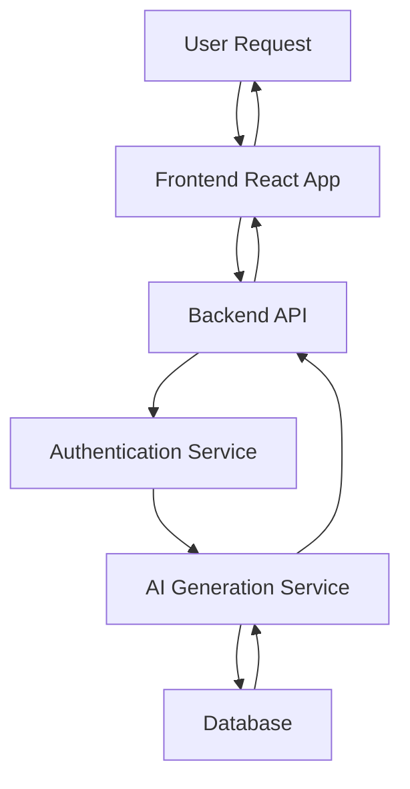

# Technical Architecture: Fantasy Character Creator

## 🏗️ Architecture Overview

The Fantasy Character Creator is built on a modern, scalable, and robust architectural foundation that leverages cutting-edge technologies to deliver a seamless user experience.

## 1. Architectural Principles

Our architecture is guided by five core principles:

1. **Modularity**
   - Loosely coupled components
   - Independent service development
   - Easy maintenance and extension

2. **Scalability**
   - Horizontal scaling capabilities
   - Microservices architecture
   - Cloud-native design

3. **Security**
   - Multi-layer security implementation
   - Role-based access control
   - Secure authentication mechanisms

4. **Performance**
   - Optimized data processing
   - Efficient resource utilization
   - Minimal latency in character generation

5. **Maintainability**
   - Clean, well-documented code
   - Continuous integration practices
   - Automated testing frameworks

## 2. Technology Stack Rationale

### Frontend
- **Technology:** React TypeScript
- **Rationale:**
  - Strong type safety
  - Component-based architecture
  - High performance rendering
  - Rich ecosystem of libraries
  - Excellent developer experience

### Backend
- **Technology:** Node.js with Express.js
- **Rationale:**
  - Non-blocking I/O
  - JavaScript ecosystem consistency
  - Rapid development
  - Extensive middleware support
  - Scalable microservices architecture

### Database
- **Technology:** PostgreSQL with Prisma ORM
- **Rationale:**
  - ACID compliance
  - Advanced data modeling
  - Strong relational data support
  - Type-safe database interactions
  - Robust migration capabilities

### AI Services
- **Technology:** Python with FastAPI
- **Rationale:**
  - Machine learning integration
  - High-performance async capabilities
  - Extensive AI/ML libraries
  - Easy model deployment

## 3. Deployment Architecture

### Infrastructure
- **Containerization:** Docker
- **Orchestration:** Kubernetes
- **Cloud Provider:** AWS/GCP

### Service Components
1. Frontend Service
2. Backend API Service
3. Authentication Service
4. AI Generation Service
5. Database Service

## 4. Integration Patterns

### Request Flow

### Key Integration Strategies
- RESTful API design
- GraphQL for flexible querying
- WebSocket for real-time updates
- Event-driven microservices communication

## 5. Future Technology Considerations

### Potential Enhancements
- Serverless architecture migration
- Advanced machine learning models
- Improved caching strategies
- Enhanced monitoring and observability
- Multi-region deployment

## 6. Technology Decision Insights

### Challenges Addressed
- Complex character generation logic
- High concurrency requirements
- Seamless AI integration
- Robust user authentication
- Scalable character storage

### Innovation Highlights
- AI-driven character creation
- Real-time avatar generation
- Comprehensive user experience
- Flexible, extensible architecture

## 7. Performance and Scalability

### Performance Targets
- Sub-500ms character generation
- Horizontal scaling to 10,000+ concurrent users
- 99.99% uptime
- Efficient resource utilization

### Scalability Approach
- Stateless service design
- Caching layers
- Distributed computing
- Auto-scaling configurations

## Conclusion

Our technical architecture represents a forward-thinking, flexible approach to building a complex, AI-driven application. By carefully selecting technologies and adhering to robust architectural principles, we've created a platform that is not just a character creator, but a foundation for future innovation.
